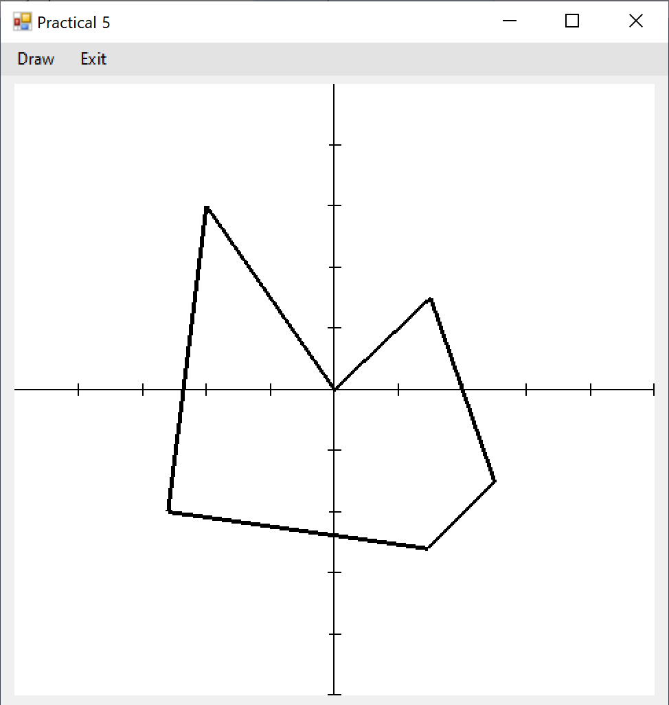
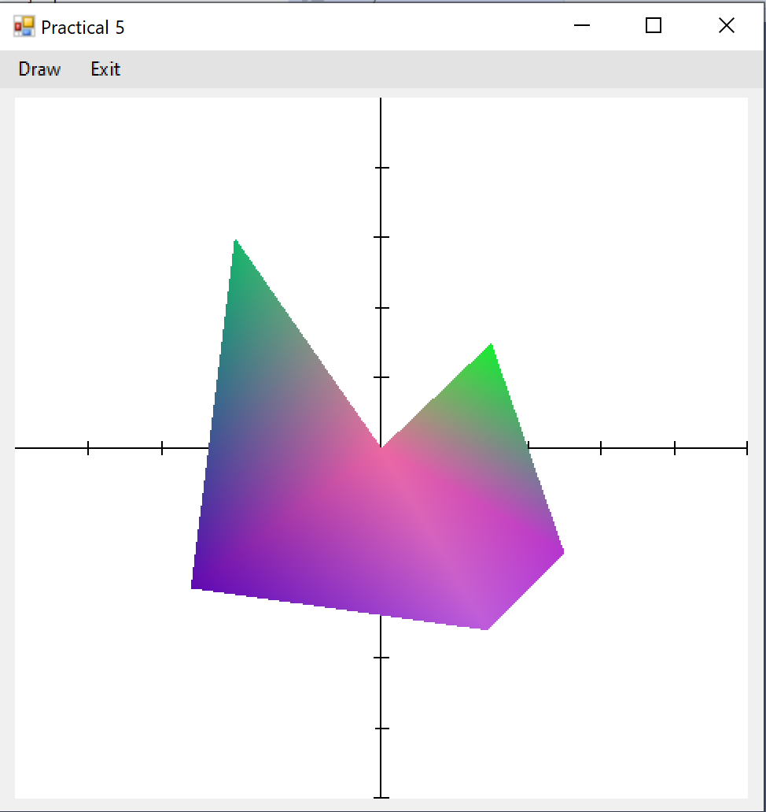

# OpenGLBasic
A C# program for drawing a figure using OpenGL.

## Technologies used in this project:

 

## Info:
A simple program that uses the OpenTK framework to draw a custom shape using OpenGL's primitive types such as LineLoop and Polygon. OpenTK is a C# graphics library superseding the Tao Framework.

The project should be opened in **Microsoft Visual Studio**. Simply compile the project and run it. You will be presented with an interface. On the menu strip choose **Draw** and then choose **Lines** to draw a shape using LineLoop primitive.

  

Then you can click on **Draw** again and choose **Polygon** to draw using polygon primitive. Notice that you get a different set of colors everytime you click on **Polygon** becuase there is a random generator in the code to set random colors.

  

 

## Note

Feel free to download the project and build upon it. Happy coding!
